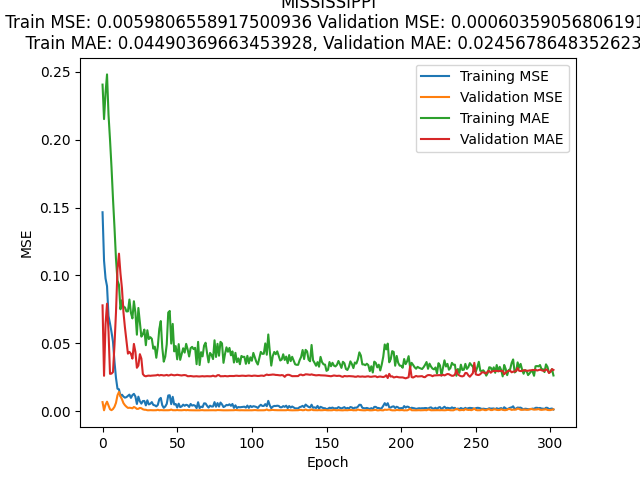

# CORN ACRES PREDICTION

Best model implemented after carrying out the benchmarking displayed on the [presentation](https://docs.google.com/presentation/d/1K3sVNdTJEMHYU-VL3SviTjrutgGA11Ak4ZZEG9TYUYU/edit?usp=share_link). Additional documents regarding to this project are found in [THIS](https://drive.google.com/drive/folders/1Iv-z9hWppyliFf9jWoutB3Ts5Iu2bEVs?usp=share_link) Drive folder.

## About
This git has been created and executed beforehand to have all results already without the neccesity of run it again. However, every process is set with a seed, so in case of removing all results, from the **/exdata** folder, is possible to reproduce all the files that resulted from the pipeline.

## In case of reexecuting

### Prerequisites

1. Install python 3.8

### Installation

1. Clone the repository in your personal device using the following command:

```sh
git clone https://github.com/saraalgo/Corn-2023.git
```

2. Create and activate python environment if you do not count with the beforehand mentioned Python version. Otherwise, you could skip this step.

```sh
python3.8 -m venv ANN-GA/
source bin/activate
```

3. Upgrade pip and install project requirements 
```sh
python -m pip install --upgrade pip
python -m pip install -r requirements.txt
```

## Project workflow

1. [Preprocess data](#1.-Preprocess-data)
    - [Load data to unify formats](#1.1-Load-data-an-unify-formats)
    - [Get data to introduce to the model](#1.2-Get-data-to-introduce-to-the-model)
    - [Outputs](#1.3-Outputs)

2. [Model](#2.-Model)
    - [Design and train the model](#2.1-Design-and-train-the-model)
    - [Outputs](#2.2-Output)

3. [Predict](#3.-predict)
    - [Get predictions and feature importance of features](#3.1-Get-predictions,-metrics-and-feature-importance)
    - [Outputs](#3.2-Outputs)


### 1. Preprocess data
This is done in the folder **01-Preprocessing**.

#### 1.1 Load data an unify formats
In the [*Load-data.ipynb*](https://github.com/saraalgo/ANN-GA/blob/main/01-Preprocessing/Load-data.ipynb) notebook is shown how the external data is loaded from the orignial formats and it is stored in the folder **data**.

### 1.2 Get data to introduce to the model
Here in [*Preprocessing.ipynb*](https://github.com/saraalgo/ANN-GA/blob/main/01-Preprocessing/Preprocessing.ipynb) the data found in the benchmarking as more efective for the best model in merged to be introduced to the model.

### 1.3 Outputs
The final data can be found in can be found in **01-Preprocessing/results/** as *data.pkl*.

### 2. Model
This is carried out in the folder **02-Model**.

#### 2.1 Design and train the model
The [*02-Model/best_model.ipynb*](https://github.com/saraalgo/ANN-GA/blob/main/02-Model/best_model.ipynb) notebook follows the next pipeline:
1. Load data
2. Train model by state
3. Plot training metrics performance
4. Plot predictions of the model
5. Save predictions and other data

Each step is further explained during the execution. **Is important to bare in mind that this final LSTM architecture selected will be trained for each state**, not with all as a whole, finding also that among the state will be variabilty in the number of features used as input.

#### 2.2 Outputs
After run the previous notebook, a new folder called **02-Model/results** will appear with the next subfolders:

[**02-Model/results/best_model/plots**](https://github.com/saraalgo/ANN-GA/blob/main/02-Model/results/best_model/plots)

Inside, another two folders will store graphical information about how the training have evolve over the epochs of the LSTM model. In this regard, as there will be a model per state, an example of **Missisipi** results in this folders will be shown as example:

- **02-Model/results/best_model/plots/prediction**: Graph of the actual data and the predictions for training and 2023 output values:


- **02-Model/results/best_model/plots/training**: Graph of the metrics evolution during the epochs in train and test:



[**02-Model/results/best_model/res**](https://github.com/saraalgo/ANN-GA/blob/main/02-Model/results/best_model/res)

This subfolder will get the final dictionaries for all states storing all relevant data of the training process:
- Data per state used as input: *data_per_state.pkl*.
- The Time Series Generators created from each state data to be introduced as train/test in the model: *train_generator_per_state.pkl* and *future_generator_per_state.pkl*.
- The final metrics obtained for each model: MSE and MAE in train and test: *mse_train.pkl*, *mae_train.pkl*, *mse_test.pkl* and *mae_test.pkl*.
- Final models for each state: *model_per_state.pkl*.
- Predictions for 2023: *predictions.pkl*.

### 3. Predict

#### 3.1 Get predictions, metrics and feature importance
The notebook [*best_model_pred.ipynb*](https://github.com/saraalgo/ANN-GA/blob/main/03-Predict/best_model_pred.ipynb) provides a pipeline to get the following:

1. Feature importance of each state model
    - Check feature importance in all states
    - Plot feature importance for each state
    - Plot feature importance of all at once
2. Predictions for 2023 and final metrics by state

Each step is further explained during its execution.

#### 2.2 Outputs
From this folder the following documents are stored in [**03-Predict/results**](https://github.com/saraalgo/ANN-GA/blob/main/03-Predict/results/):

- *best_model.xlsx*: it is a excel file with a sheet with the final training metrics for the model on each state and the prediction of the output for 2023.
- *feature-importance-all-states.png*: which gather the feature importance obtained from input perturbation for the features of all models at once, highlighting the top 5 more relevant for all 48 states. To calculate each feature value, it were calculated for each state the number of features that had a higher perturbation of twice the baseline MSE, setting that as threshold. Then, the counting of in how many states that feature was important were summed and represented in this figure.


- [**03-Predict/results/feature-importance-train/**](https://github.com/saraalgo/ANN-GA/blob/main/03-Predict/results/feature-importance-train/): in this subfolder each state mse (including the baseline mse obtained during training) was calculated for each feature being perturbated. Moreover, a vertical red line is included, calculated from the threshold stablished for each state that would imply a high importance of that feature if its surpassed (above set as twice baseline mse). An example of this is shown again with **Missisipi**:


- *feature-importance-by-state.pdf*: unify all files of each state with the feature importance information that are contained in the **03-Predict/results/feature-importance-train**.
